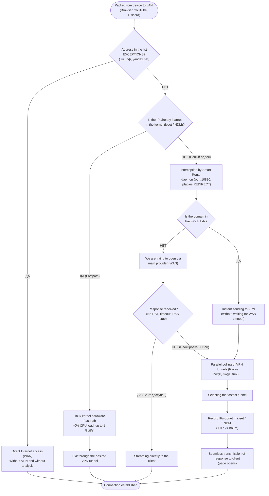
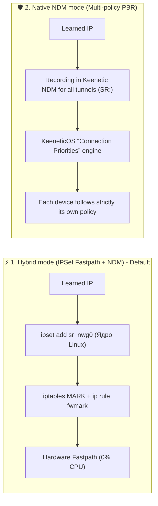
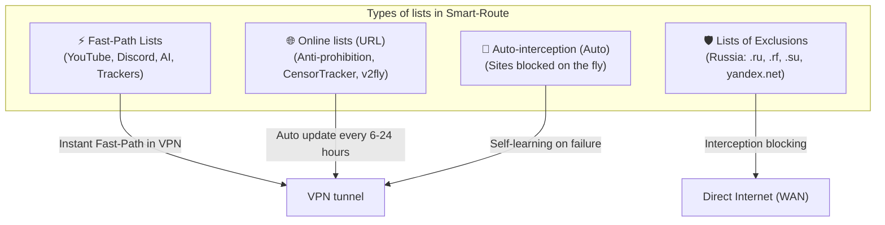

# User Guide and Smart-Route Architecture

**Smart-Route** is a high-performance, lightweight system service with a built-in web interface for **Keenetic** routers with the **Entware** environment installed.

---

## 🎯 1. What is the main idea of ​​Smart-Route?

Regular VPN clients either allow **all** traffic through the VPN (which is why Russian websites and banks do not open or are slow) or require you to manually maintain huge lists of routes.

**Smart-Route solves this problem automatically and in hardware:**
1. **Seamless Failover**: If the site is not blocked, it opens directly at your ISP's maximum speed. If the site is blocked (TCP RST, timeout, reset from TSPU/DPI), Smart-Route **pick up the connection on the fly**, finds a working VPN tunnel and transfers the data to the client **without breaking the browser tab**.
2. **Kernel Offload via IPSet / NDM**: after the first successful connection, the address is instantly remembered in the Linux kernel. All subsequent gigabytes and 4K video are transferred **by the router’s hardware chip at speeds of up to 1 Gbps with 0% processor load**.

---

## 🏛️ 2. Flowchart: Connection Lifecycle

Below is what happens with each network packet from your smartphone, PC or Smart TV:



---

## ⚙️ 3. Routing Engines

In the **"Settings"** section of the control panel, you can switch the operating logic:



|Parameter|⚡ Hybrid mode (IPSet Fastpath)|🛡️ Native Keenetic NDM mode|
| :--- | :--- | :--- |
|**Speed ​​and load**|**Maximum** (hardware offload, 0% CPU)|Standard routing speed KeeneticOS|
|**Capacity**|**100,000+ IPs and subnets** without loss of speed|Up to tens of thousands of routes|
|**Targeting (TTL)**|**Automatic (24h)** - the kernel itself clears unused IPs|Cleaned up by the background SmartRoute daemon|
|**Multi-Policy Support**|For networks with a single gateway|**Ideal for complex policies** (TV $\rightarrow$ VPN1, PC $\rightarrow$ VPN2)|

---

## 📋 4. Domain Lists and Exclusion Lists

List management is available on the **"Domain Lists"** tab:



### 1. Direct access lists (Fast-Path)
- Domains and subnets (`youtube.com`, `discord.com`, `openai.com`, etc.) are sent to the VPN instantly, without waiting for a timeout from the main provider.

### 2. Exception lists (Direct WAN / Direct access)
- If the list has the toggle switch **“🛡️ List of exceptions”** turned on:
  - All domains, national zones (`.ru`, `.рф`, `.su`) and subdomains (`yandex.net`, `*.yandex.net`, `gosuslugi.ru`) **are always opened directly through your provider**.
  - The daemon never tries to route them to the VPN and does not clog the routing tables.

### 3. Online lists from the Internet (URL & Preset Directory)
- Links to `raw.githubusercontent.com`, `prostovpn.org`, text files `.txt` and `.csv` are supported.
- The catalog contains **30+ popular presets in one click** (Anti-ban, ITDog Allow2ban, v2fly, torrents, cinemas).
- If a site with a list is blocked by your provider, Smart-Route will automatically download it through a backup VPN channel.

---

## 🖥️ 5. Review of sections of the Web interface

The web control panel is available at `http://172.16.5.1:8088` (or your router IP):

```
┌─────────────────────────────────────────────────────────────────────────────┐
│ 🧭 Smart-Route  v1.0.9                        [🟢 Служба активна]  [Выход]  │
├─────────────┬─────────────┬─────────────┬─────────────┬─────────────┬───────┤
│ 📊 Дашборд  │ 🌐 Списки   │ 🔀 Маршруты │ 🛣️ NDM      │ 🔌 Интерфейсы│ ⚙️ Настр│
└─────────────┴─────────────┴─────────────┴─────────────┴─────────────┴───────┘
```

1. **📊 Dashboard (Overview)**:
   - Live counters of active routes, saved connections (Failover), tunnel status, memory consumption (total ~1.3 MB RAM) and uptime.
2. **🌐Domain Lists**:
   - Creation, editing, loading of ready-made presets, inclusion of exclusion lists and manual synchronization.
3. **🔀 Dynamic routes (IPSet)**:
   - Table of learned kernel addresses in real time: target IP, domain/SNI, tunnel, remaining TTL, Latency and delete button.
4. **🛣️ Keenetic Routes (NDM)**:
   - Complete native KeeneticOS routing table with all providers, tunnels and `SR:` tags.
5. **🔌 Network interfaces**:
   - List of router network interfaces (`nwg0`, `tun0`, `ppp0`...), setting their priorities and a quick enable/disable button.
6. **🩺Diagnostics (Probe)**:
   - Instant test of any website or IP immediately through **all** available interfaces, measuring latency and HTTP/TLS codes.
7. **⚙️Settings**:
   - Selecting the operating mode (Hybrid IPSet vs Native NDM), primary polling timeouts, interception ports and panel access password.

---

## 🛠️ 6. Management commands in the router console (SSH)

If you need to manage the service via the Entware command line:

```bash
# Проверить статус службы
/opt/etc/init.d/S99smart-route status

# Перезапустить службу
/opt/etc/init.d/S99smart-route restart

# Остановить службу (с автоматической очисткой правил iptables и ipset)
/opt/etc/init.d/S99smart-route stop

# Просмотр живого журнала логов
tail -f /opt/var/log/smart-route.log

# Просмотр активных таблиц ipset ядра
ipset list sr_nwg0
```

---

## 🚀 7. Quick start: 3 simple steps

1. **Step 1**: Open `http://172.16.5.1:8088/#interfaces` and make sure your VPN connections (eg `nwg0` for WireGuard) are enabled.
2. **Step 2**: Open `http://172.16.5.1:8088/#domain-lists` - by default, the main lists (YouTube, Discord, AI, RF Exceptions) are already active and ready to go.
3. **Step 3**: Use the Internet - all blocked resources will open automatically and seamlessly!

---

## 🗑️ 8. Complete removal of Smart-Route

### Automatically:
```bash
curl -sSL https://raw.githubusercontent.com/DFR11/Snakelair-Keenetic-Entware-OPKG-Repository/main/uninstall.sh | sh -s smart-route
```

### Manually via SSH:
```bash
/opt/etc/init.d/S99smart-route stop
killall -9 smart-route 2>/dev/null
opkg remove smart-route --force-remove --force-depends
rm -f /opt/etc/init.d/S99smart-route /tmp/smart-route.log /opt/var/log/smart-route.log
rm -rf /opt/etc/smart-route

# Очистка правил iptables и ipset
iptables -t nat -D PREROUTING -p tcp -m multiport --dports 80,443 -j REDIRECT --to-ports 10880 2>/dev/null
iptables -t nat -D PREROUTING -p udp --dport 53 -j REDIRECT --to-ports 10853 2>/dev/null
for s in $(ipset list -n 2>/dev/null | grep -E '^sr_'); do ipset flush "$s"; ipset destroy "$s"; done
```
